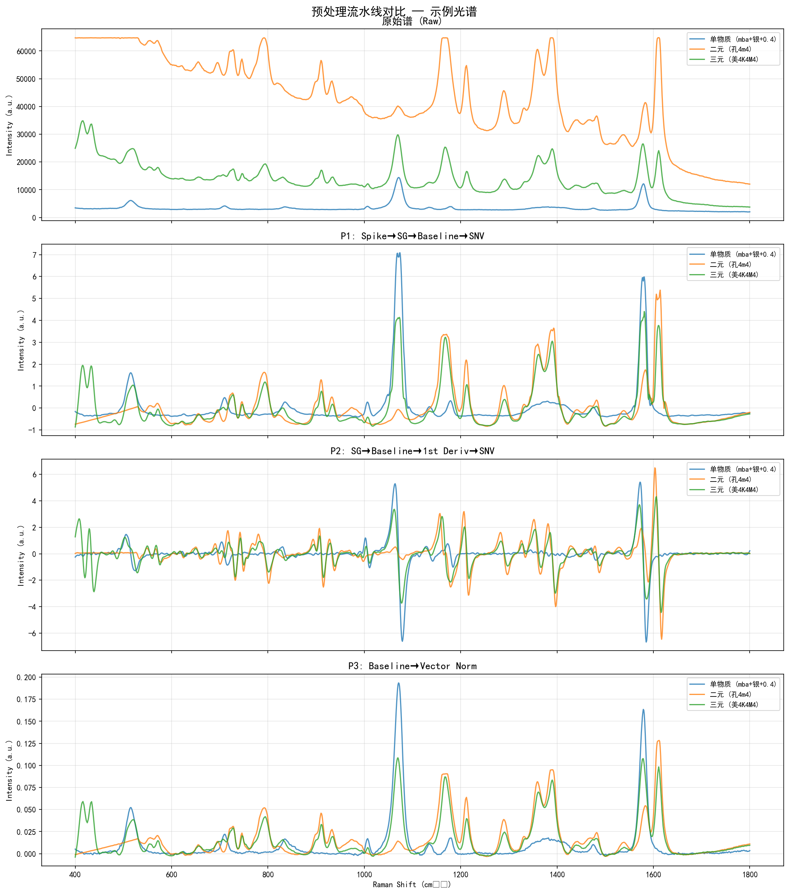
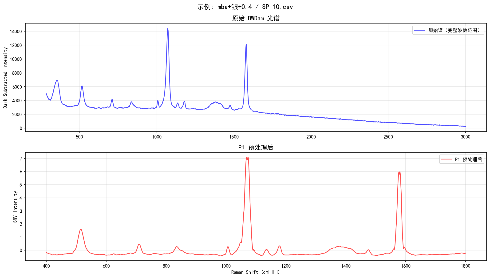

# 阶段 3：预处理报告

> 生成时间: 2026-03-14 19:08:50

## 一、波数轴统一

| 参数 | 值 |
|------|-----|
| 目标波数范围 | 400.0 - 1800.0 cm⁻¹ |
| 波数步长 | 1.0 cm⁻¹ |
| 统一后点数 | 1401 |
| 输入光谱数 | 807 |
| 插值方法 | 线性插值 (scipy.interpolate.interp1d) |

## 二、预处理流水线说明

### P1: Spike Removal → SG Smoothing → Baseline Correction → SNV
- **Cosmic spike removal**: Modified Z-score 检测，阈值=7.0，窗口=5
- **SG smoothing**: window=11, polyorder=3
- **Baseline correction**: Asymmetric Least Squares (ALS), λ=1e+06, p=0.01, niter=10
- **SNV**: Standard Normal Variate (行级标准化)

### P2: SG Smoothing → Baseline Correction → 1st Derivative → SNV
- **SG smoothing**: window=11, polyorder=3
- **Baseline correction**: ALS 同 P1
- **1st derivative**: SG 一阶导数，window=11, polyorder=3
- **SNV**: Standard Normal Variate

### P3: Baseline Correction → Vector Normalization
- **Baseline correction**: ALS 同 P1
- **Vector normalization**: L2 范数归一化

## 三、输出文件

| 文件 | 形状 | 说明 |
|------|------|------|
| wavenumber.npy | (1401,) | 统一波数轴 |
| X_raw.npy | (807, 1401) | 插值后原始谱 |
| X_p1.npy | (807, 1401) | P1 预处理 |
| X_p2.npy | (807, 1401) | P2 预处理 |
| X_p3.npy | (807, 1401) | P3 预处理 |

## 五、波数范围不完整的光谱

| 说明 |
|------|
| S0502: 部分波数范围缺失 (493.1-2001.5) |
| S0503: 部分波数范围缺失 (493.1-2001.5) |
| S0504: 部分波数范围缺失 (493.1-2001.5) |
| S0505: 部分波数范围缺失 (493.1-2001.5) |
| S0506: 部分波数范围缺失 (493.1-2001.5) |
| S0507: 部分波数范围缺失 (493.1-2001.5) |
| S0508: 部分波数范围缺失 (493.1-2001.5) |
| S0509: 部分波数范围缺失 (493.1-2001.5) |
| S0510: 部分波数范围缺失 (493.1-2001.5) |
| S0511: 部分波数范围缺失 (493.1-2001.5) |
| S0512: 部分波数范围缺失 (493.1-2001.5) |
| S0513: 部分波数范围缺失 (493.1-2001.5) |
| S0514: 部分波数范围缺失 (493.1-2001.5) |
| S0515: 部分波数范围缺失 (493.1-2001.5) |
| S0516: 部分波数范围缺失 (493.1-2001.5) |
| S0517: 部分波数范围缺失 (493.1-2001.5) |
| S0518: 部分波数范围缺失 (493.1-2001.5) |
| S0519: 部分波数范围缺失 (493.1-2001.5) |
| S0520: 部分波数范围缺失 (493.1-2001.5) |
| S0521: 部分波数范围缺失 (493.1-2001.5) |
| ... 共 88 条 |

## 六、预处理前后对比图

### 三类谱对比

### 原始 vs P1

## 七、数据质量备注

1. 所有预处理脚本使用固定随机种子 (seed=42)，保证可复现性。
2. 波数范围 400.0-1800.0 cm⁻¹ 是根据所有光谱的公共覆盖区域确定的。
3. ALS 基线校正的参数选取是保守估计，后续可根据 EDA 结果微调。
4. P1 适合直接作为大多数模型的输入（去噪+去基线+标准化）。
5. P2 包含一阶导数，能突出光谱特征的变化率，对微小差异更敏感。
6. P3 最简单，仅做基线校正和归一化，保留更多原始光谱形态。
